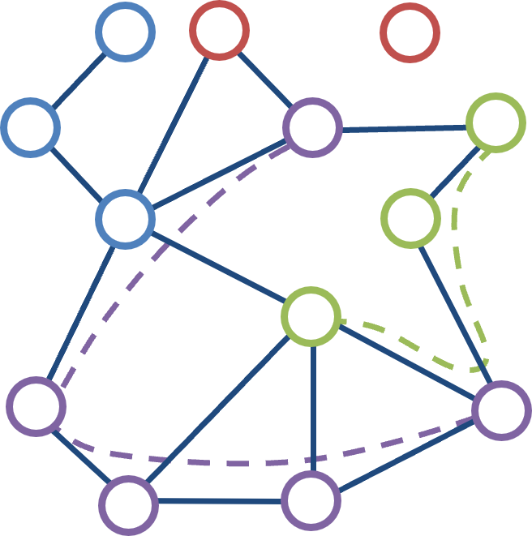

# metaMetro 
### Totally coloured graphs for metagenomic assembly and graph learning

[](VERSION)
[](https://github.com/dsmutin/MetaMetro/actions/workflows/required-tests.yml)
[](https://github.com/dsmutin/MetaMetro/actions/workflows/full-tests.yml)
[](LICENSE)

Assembly graphs are built to spell contigs. Sample membership, genome labels, and the original nodes disappear as soon as the graph is compacted, so a later model cannot point a prediction back at the read or the genome that produced it. **metaMetro** keeps that chain. One identity runs from genome and read, through a canonical graph, a compacted coloured graph, and a tensor a graph model can train on. Each step is a contract: the contract states what must survive, and the code under it can be replaced without renegotiating the contract.

Concepts and recorded runs are on the [wiki](https://github.com/dsmutin/MetaMetro/wiki). File layouts and the seven contracts in full are in [docs/formats.md](docs/formats.md), [docs/contracts.md](docs/contracts.md), and [docs/implementation.md](docs/implementation.md).

## What it does

metaMetro stores one metagenomic assembly graph in three representations:

| Format | Role |
| --- | --- |
| **CFA** | Canonical exchange format. Nodes, sequences, edges, sample colours, and labels. This is the semantic source of truth. |
| **CDBG** | ToCUMG: a totally coloured universal metagenomic graph. Non-branching paths are compacted into unitigs. Every CFA node and edge is still recoverable, as a unitig member, an internal edge, or a link. An optional annotation sidecar holds measurements that are not topology. |
| **CGT** | Coloured graph tensor. CSR adjacency and aligned numeric arrays for graph learning. DNA stays on the CDBG. Predictions are a separate table joined by the same ids. |

Identity that every stage must preserve:

```text
genome → read → CFA node → CDBG unitig → CGT dense id → analysis result
CFA edge → CDBG link or internal edge → CGT CSR slot (links only)
```

## How it works

Seven contracts, in order:

1. **Genome → metagenome.** Slice reads in-process, or call Samovar `generate` (InSilicoSeq). Each read keeps a genome id.
2. **Metagenome → graph.** Build a de Bruijn graph, or load an assembler graph (MEGAHIT intermediate FASTG, Flye GFA).
3. **Graph → CFA.** Write the canonical directory (`metadata.yaml`, `nodes.fna`, `nodes.tsv`, `edges.tsv`).
4. **Colouring.** Colour nodes by read depth and edges by junction density. Colours are sets. The operations are `replace`, `merge`, `intersect`, and `subtract`. Topology does not change.
5. **CFA → CDBG.** Compact non-branching paths. Colours on a unitig are the union of its members. The mapping back to CFA nodes is mandatory.
6. **CDBG → CGT.** Renumber unitigs to dense ids and store topology as CSR. Features, training labels, and colours stay in separate arrays. A feature registry names the columns. Incoming adjacency (CSC) is derived when needed and is not a second stored graph.
7. **Analysis on CGT.** Train a graph convolution (NumPy by default, PyTorch Geometric when requested). Results carry `dense_id`, the CDBG unitig id, and the CFA node ids. The input tensor is not modified.

An edit proposal is not an eighth format. `apply_edit_proposal` returns a new CDBG. Splits stay on CFA member boundaries, and new unitig ids record their parents. They are not biological names.

```python
from metametro import cfa_to_cdbg, cdbg_to_cgt, mock_cfa, run_ds

cdbg = cfa_to_cdbg(mock_cfa())
cgt = cdbg_to_cgt(cdbg)
print(run_ds(cgt, seed=0)["metadata"])
```

## Install

Conda is the only supported install:

```bash
conda env create -f environment.yml
conda activate metametro
```

`environment.yml` sets `PYTHONPATH=src` and pins every dependency.

The Contract 7 PyTorch Geometric backend is optional and is not in the required environment:

```bash
conda env create -f environment-pyg.yml
conda activate metametro-pyg
pytest -m optional
```

## Usage

```bash
metametro --version
python examples/mock_pipeline/run.py
python examples/cgt_ml/run.py
python examples/cdbg_annotation/run.py
python examples/edit_proposal/run.py
```

`examples/toy/run.py` checks the CLI baseline JSON (`status`, `ok`, `input_path`). The external phage run (Samovar reads, MEGAHIT intermediate graph, colouring, CDBG, CGT, both GCN backends) is `scripts/phage_baseline.py`, recorded in [docs/baseline-run.md](docs/baseline-run.md).

Benchmark graphs are built with `metametro benchbuild`. The default directory is `data/bench/{name}/{assembler}/{properties}/` and is gitignored. See [docs/benchmarks.md](docs/benchmarks.md).

```bash
metametro benchbuild --list
metametro benchbuild bubble_strain_2
```

## Tests

```bash
pytest -m mandatory    # every commit
pytest                 # mandatory and optional
```

The mandatory marker selects 138 tests. One further test is marked optional and runs when PyTorch Geometric is installed.

## License

MIT. See [LICENSE](LICENSE) and [CONTRIBUTING.md](CONTRIBUTING.md).
